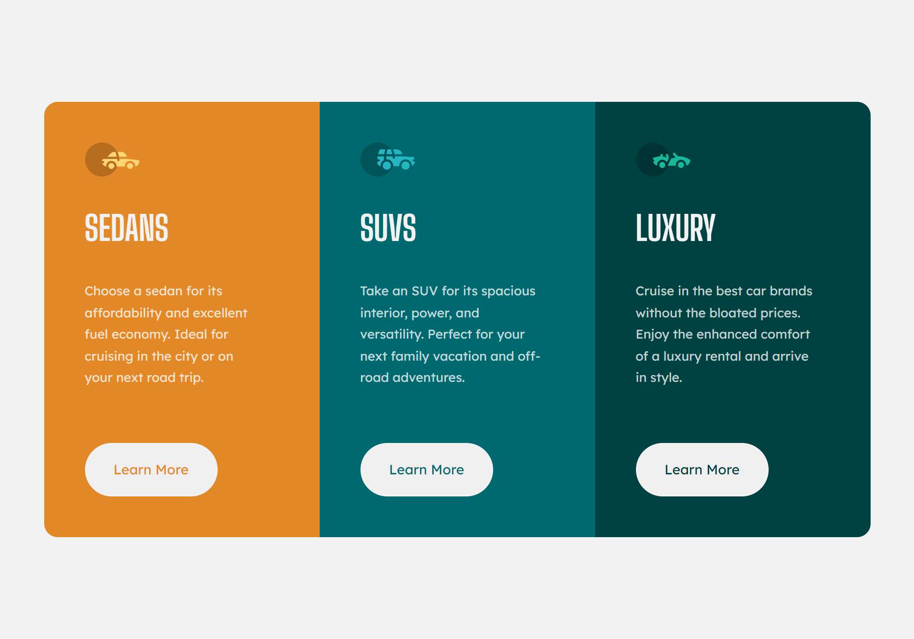

# Frontend Mentor - 3-column preview card component solution

This is a solution to the [3-column preview card component challenge on Frontend Mentor](https://www.frontendmentor.io/challenges/3column-preview-card-component-pH92eAR2-). Frontend Mentor challenges help you improve your coding skills by building realistic projects. 

## Table of contents

- [Overview](#overview)
  - [The challenge](#the-challenge)
  - [Screenshot](#screenshot)
  - [Links](#links)
- [My process](#my-process)
  - [Built with](#built-with)
  - [What I learned](#what-i-learned)
  - [Useful resources](#useful-resources)
- [Author](#author)


## Overview

### The challenge

Users should be able to:

- View the optimal layout depending on their device's screen size
- See hover states for interactive elements

### Screenshot





### Links

- FrontEndMentor profile: [here](https://www.frontendmentor.io/solutions/3column-preview-card-component-YPAKQMiDWJ)
- You can view the site: [here](https://jabrayilzadeali.github.io/3-column-preview-card-component-main-by-frontendmentor/)

## My process

### Built with

- Semantic HTML5 markup
- CSS custom properties
- CSS BEM notation
- CSS Grid
- Mobile-first workflow

### What I learned

Use this section to recap over some of your major learnings while working through this project. Writing these out and providing code samples of areas you want to highlight is a great way to reinforce your own knowledge.

- How to use Bem Notation
- How to write better css

To see how you can add code snippets, see below:

```html
<!DOCTYPE html>
<html lang="en">
<head>
  <meta charset="UTF-8">
  <meta name="viewport" content="width=device-width, initial-scale=1.0"> <!-- displays site properly based on user's device -->

  <link rel="icon" type="image/png" sizes="32x32" href="./images/favicon-32x32.png">

  <!-- Google Fonts -->
  <link rel="preconnect" href="https://fonts.googleapis.com">
  <link rel="preconnect" href="https://fonts.gstatic.com" crossorigin>
  <link href="https://fonts.googleapis.com/css2?family=Big+Shoulders+Display:wght@700&family=Lexend+Deca&display=swap" rel="stylesheet">

  <!-- My Stylesheet -->
  <link rel="stylesheet" href="style.css"> 
  <title>Frontend Mentor | 3-column preview card component</title>

</head>
<body>
  
  <main class="grid-center">
    <section class="grid">
      <article class="card card--bright-orange">
        
        <h2 class="card__title uppercase">Sedans</h2>
        <p class="card__description">
          Choose a sedan for its affordability and excellent fuel economy. Ideal for cruising in the city 
          or on your next road trip.
        </p>
        <button class="button button--bright-orange">Learn More</button>
      </article>

      <article class="card card--dark-cyan">
        
        <h2 class="card__title uppercase">SUVs</h2>
        <p class="card__description">
          Take an SUV for its spacious interior, power, and versatility. Perfect for your next family vacation 
          and off-road adventures.
        </p> 
        <button class="button button--dark-cyan">Learn More</button>
      </article>

      <article class="card card--very-dark-cyan">
        
        <h2 class="card__title uppercase">Luxury</h2>
        <p class="card__description">
          Cruise in the best car brands without the bloated prices. Enjoy the enhanced comfort of a luxury 
          rental and arrive in style.
        </p>
        <button class="button button--very-dark-cyan">Learn More</button>
      </article>
    </section>
  </main>
  
</body>
</html>
```
```css
:root {
    /* Primary */
    --Bright-orange: hsl(31, 77%, 52%);
    --Dark-cyan: hsl(184, 100%, 22%);
    --Very-dark-cyan: hsl(179, 100%, 13%);
    
    /* Neutral */
    --Transparent-white-paragraphs: hsl(0, 0%, 100%, 0.75);
    --Very-light-gray-background-headings-buttons: hsl(0, 0%, 95%);

    /* fonts */
    --ff-accent: 'Big Shoulders Display', cursive;
    --ff-base: 'Lexend Deca', sans-serif;

    --fw-regular: 400;
    --fw-bold: 700;
}


/* Josh Comeau css reset */
/*
  1. Use a more-intuitive box-sizing model.
*/
*, *::before, *::after {
  box-sizing: border-box;
}
/*
  2. Remove default margin
*/
* {
  margin: 0;
}
/*
  3. Allow percentage-based heights in the application
*/
html, body {
  height: 100%;
}
/*
  Typographic tweaks!
  4. Add accessible line-height
  5. Improve text rendering
*/
body {
  line-height: 1.7;
  -webkit-font-smoothing: antialiased;
}
/*
  6. Improve media defaults
*/
img, picture, video, canvas, svg {
  display: block;
  max-width: 100%;
}
/*
  7. Remove built-in form typography styles
*/
input, button, textarea, select {
  font: inherit;
}
/*
  8. Avoid text overflows
*/
p, h1, h2, h3, h4, h5, h6 {
  overflow-wrap: break-word;
}
/*
  9. Create a root stacking context
*/
#root, #__next {
  isolation: isolate;
}

body {
  font-family: var(--ff-accent);
  font-weight: var(--fw-bold);

  color: var(--Transparent-white-paragraphs);
}

main {
  padding: 5rem 1rem;
}

section {
  overflow: hidden;
  border-radius: 1rem;
}

/* utilities */
.grid-center {
  display: grid;
  min-height: 100vh;
  place-content: center;
  overflow: auto;
}

.uppercase {
  text-transform: uppercase;
}

.button {
  border-radius: 5rem;
  border: 0;
  padding: 1rem 2rem;
  font-size: 1rem;
  font-family: var(--ff-base);
  font-weight: var(--fw-regular);
  border: 2px solid var(--Very-light-gray-background-headings-buttons);
}

.button:hover {
  background-color: transparent;
  color: var(--Very-light-gray-background-headings-buttons);
  cursor: pointer;
}

/* design */

.card {
  padding: 3rem;
  font-size: 2rem;
  /* height: 25rem; */
}

.card__title {
  font-size: 2.5rem;
  margin: 1.7rem 0;
  color: var(--Very-light-gray-background-headings-buttons);
}

.card__description{ 
  margin-bottom: 1rem;
  padding-right: 1rem;
  color: var(--Transparent-white-paragraphs);
  font-size: 0.938rem;
  font-family: var(--ff-base);
  font-weight: var(--fw-regular);
}

.card--bright-orange {
  background-color: var(--Bright-orange); 
} 

.card--dark-cyan {
  background-color: var(--Dark-cyan); 
}

.card--very-dark-cyan {
  background-color: var(--Very-dark-cyan); 
}

.button--bright-orange {
  color: var(--Bright-orange); 
} 

.button--dark-cyan {
  color: var(--Dark-cyan); 
}

.button--very-dark-cyan {
  color: var(--Very-dark-cyan); 
}

@media screen and (min-width: 996px) {
  main, section {
    padding: 0;
  }

  section.grid {
    display: grid;
    grid-template-columns: repeat(3, 324px);
    grid-template-rows: 1fr;
  }

  .button {
    margin-top: 3rem;
  }

}
```

### Useful resources

- [Taking on a Frontend Mentor challenge | Responsive Product Preview Card Component | by Kevin Powell ](https://www.youtube.com/watch?v=B2WL6KkqhLQ&t=1051s) - helped me to understand good css system(BEM, css reset).
- [Why I use the BEM naming convention for my CSS | by Kevin Powell ](https://www.youtube.com/watch?v=SLjHSVwXYq4) - Fantastic explanation of css BEM notation


## Author

- Github - [jabrayilzadeali](https://github.com/jabrayilzadeali)
- Frontend Mentor - [Jabrayilzade Ali](https://www.frontendmentor.io/profile/jabrayilzadeali)
- Twitter - [Jabrayilzade Ali](https://twitter.com/JabrayilzadeAli)